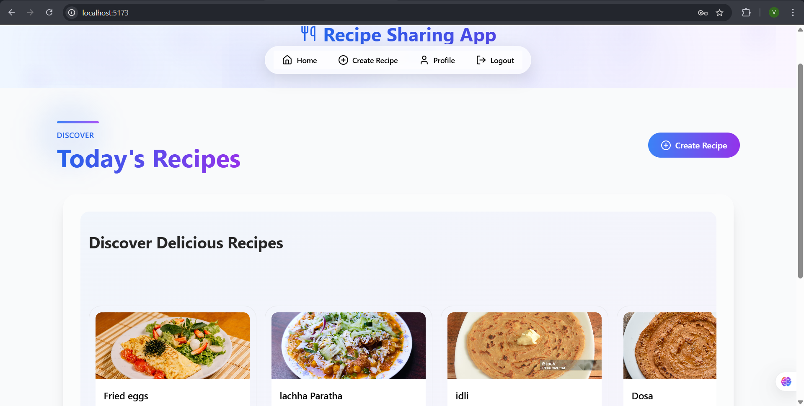

Recipe Sharing App  
A modern, full-stack web application for sharing, discovering and managing recipes with a beautiful UI built using React, Express, and MySQL.  
  
📋 Features
User Authentication: Secure login and registration system with JWT authentication  
Recipe Management: Create, view, edit, and delete recipes   
Recipe Search: Find recipes by title, ingredients, or description   
Responsive Design: Beautiful UI that works on mobile, tablet, and desktop devices  
Profile Management: User profiles with recipe history  

🛠️ Tech Stack  
Frontend  
React  
Axios for API requests  
TailwindCSS for styling  
Motion/React for animations  
Lucide React for icons  
Aceternity-inspired UI components  
Backend  
Node.js with Express  
MySQL database  
Sequelize ORM  
JWT for authentication  
Bcrypt for password hashing 

🚀 Getting Started  
Prerequisites  
Node.js (v18 or higher)  
MySQL Server  
npm or yarn

📁 Project Structure  
recipe-sharing-app/  
├── backend/
│   ├── config/           # Database configuration  
│   ├── controllers/      # Request handlers  
│   ├── middleware/       # Custom middleware (auth, etc.)  
│   ├── models/           # Sequelize models  
│   ├── routes/           # API endpoints  
│   ├── utils/            # Helper functions and utilities  
│   ├── .env              # Environment variables  
│   ├── index.js          # Entry point  
│   └── package.json  
│
└── frontend/  
    ├── public/           # Static assets  
    ├── src/  
    │   ├── components/   # Reusable UI components  
    │   ├── context/      # React context providers  
    │   ├── hooks/        # Custom React hooks  
    │   ├── lib/          # Utility functions  
    │   ├── pages/        # Page components  
    │   ├── services/     # API service calls  
    │   ├── utils/        # Helper functions  
    │   ├── App.jsx       # Main app component  
    │   ├── index.css     # Global styles  
    │   └── main.jsx      # Entry point  
    ├── index.html  
    ├── package.json  
    └── tailwind.config.js  

    
🌟 Key Features Implementation  
Authentication  
The app uses JWT-based authentication with token expiration and secure storage. User passwords are hashed using bcrypt before storing in the database.  
  
Recipe Management  
Recipes include detailed information such as:  
  
Title and description      
Preparation and cooking times  
Difficulty level  
Serving size    
Featured image    
Each recipe can be downloaded as a beautifully formatted PDF document that includes:  
  
Recipe details and image     
Cooking information  
Author details  
  
🛣️ API Endpoints  
Authentication  
POST /api/auth/register - Register a new user  
POST /api/auth/login - User login  
GET /api/auth/me - Get current user  
  
Users  
GET /api/users/profile - Get user profile  
PUT /api/users/:id - Update user profile  
  
  
Recipes  
GET /api/recipes - Get all recipes (with pagination)  
GET /api/recipes/:id - Get recipe by ID  
POST /api/recipes - Create a new recipe  
PUT /api/recipes/:id - Update a recipe  
DELETE /api/recipes/:id - Delete a recipe  
GET /api/recipes/search - Search recipes  
  
🖼️ UI Components  
The app uses modern UI components including:  
Floating navigation with smooth animations  
Glowing card effects  
Motion transitions and hover states  
Aceternity-inspired grid backgrounds and particle animations  
Responsive cards and layouts 
  
🔒 Security Features  
JWT-based authentication  
Password hashing with bcrypt  
Token expiration handling  
Protected routes  
Form validation  
Secure HTTP-only cookies  
Error handling and validation  
  
  
📱 Responsive Design  
The application is fully responsive and works on:  
Mobile devices  
Tablets  
Desktop computers  
